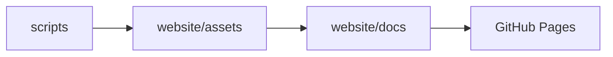

# Architecture Overview

## Design Philosophy

This repository adopts a **decoupled, three-layer architecture** to clearly separate
**computation**, **artifacts**, and **presentation**.

The primary goals of this design are:

- To prevent analytical workflows from being coupled to website rendering
- To ensure stable and reproducible CI builds
- To improve long-term maintainability and extensibility
- To provide a clear mental model for future development

All heavy computation is executed outside of Quarto, while Quarto is used strictly
as a documentation and visualization layer.

---

## Architectural Layers

### 1. Computation Layer (`scripts/`)

The **computation layer** contains all executable source code, including:

- Bash scripts
- R scripts
- Python scripts

These scripts are designed to be executed directly from the command line or batch workflows.
They perform data processing, analysis, and report generation.

**Key rules:**

- Scripts must not depend on Quarto or the website build process
- Scripts must write all outputs to the artifact layer
- Scripts may require dedicated runtime environments (e.g., Conda, R, Python)

---

### 2. Artifact Layer (`website/assets/`)

The **artifact layer** serves as a read-only store for all generated `HTML` outputs.

Artifacts are generated exclusively by scripts and are **not modified by Quarto**.

**Key rules:**

- No computation is performed in this layer
- No `.qmd`, `.Rmd`, or source scripts should exist here
- Artifacts may be replaced by re-running scripts, without changing documentation

---

### 3. Presentation Layer (`website/`)

The **presentation layer** is implemented as a Quarto website and includes:

- `website/docs/` — Native Quarto documentation pages (`.qmd`)
- `index.qmd`, navigation, and styling configuration

This layer is responsible only for **documentation, explanation, and visualization**.

**Key rules:**

- `.qmd` files must not execute analysis code
- All dynamic or heavy computation is prohibited
- Artifacts are referenced via relative paths or embedded using iframes

---

## Data Flow

The data flow in this repository is strictly unidirectional:

- Scripts generate artifacts
- Quarto consumes artifacts
- The website is rendered and deployed via GitHub Actions

At no point does data or logic flow in the reverse direction.

---

## CI/CD Responsibilities

GitHub Actions and Quarto are used exclusively for:

- Rendering `.qmd` files
- Building the static website
- Deploying content to GitHub Pages

CI workflows do **not** execute scripts or perform analysis.

---

## Summary

This architecture ensures that:

- Analytical workflows remain reproducible and isolated
- Website rendering is fast, stable, and deterministic
- Documentation and results can evolve independently

This separation of concerns is intentional and foundational to the design of this repository.
