# 分析流程

```{mermaid}
flowchart TD
A[Gene expression matrix X<br>Class label Y<br>Study batch] --> B[Initial MINT sPLS-DA model]
B --> C[Cross validation]
C --> D[Select components]
D --> E[Tune feature number keepX]
E --> F[Final MINT sPLS-DA model]
F --> G[Visualization]
F --> H[Model evaluation]
H --> I[External validation]
```

---

# MINT 介紹

`MINT（Multivariate INTegration）`是 `mixOmics` 套件中用於`整合多個研究資料（multi-study data）`的分析方法，其目的是從不同研究或不同批次的資料中找出具有一致判別能力的特徵（biomarkers）。在實際研究中，相同類型的資料常來自不同研究中心或不同實驗平台，例如多個 RNA-seq 或微陣列研究。這些資料之間通常會存在 study effect 或 batch effect，若直接合併分析，可能會影響模型的穩定性與預測能力。

MINT 的核心概念是在模型中加入 `study factor`（研究來源），讓模型在建立分類與特徵選擇時，同時考慮不同研究之間的變異，並找出在多個研究中都具有一致判別能力的特徵。在分類分析中，`MINT` 常與 `sPLS-DA` 結合形成 `MINT sPLS-DA`，同時進行監督式分類與特徵選擇，並建立具有跨研究泛化能力的預測模型。

::: {.callout-important}
## DIABLO vs. MINT

| 方法       | 解決問題               | 整合什麼        |
| ---------- | ----------------------- | ----------- |
| **MINT**   | multi-study integration | 不同研究資料    |
| **DIABLO** | multi-omics integration | 不同 omics 資料 |
:::

::: {.callout-tip collapse="true"}
## PLS、PLS-DA 與 sPLS 的關係?

PLS (Partial Least Squares) 是一種常用於高維資料的降維與建模方法，其核心概念是透過建立 latent components（潛在變數），將大量特徵壓縮為少數幾個 component，同時最大化 X（特徵資料）與 Y（response variable）之間的關聯。

- `PLS`: 基本模型，同時考慮 X 與 Y 的關係建立 component。 (若是 PCA 只根據 X 的變異建立 component)
- `PLS-DA`: Discriminant Analysis 版本，用於分類問題
- `sPLS`: sparse PLS，可進行特徵選擇
- `sPLS-DA`: 結合分類與特徵選擇

在 omics 研究中，由於特徵數量通常遠大於樣本數，因此 sPLS-DA 常被用來同時進行分類與 biomarker 篩選。
:::

::: {.callout-tip collapse="true"}
## MINT 與 sPLS-DA 的關係?

MINT 是建立在 PLS 框架上的多研究整合方法。
其主要功能是在分析時 `同時整合來自不同研究`（studies）的資料，並`找出在多個研究中都具有一致判別能力的特徵`。

當 MINT 與 sPLS-DA 結合時，便形成 `MINT sPLS-DA` 方法，其同時具備三個功能：

- 分類（classification）：區分不同 phenotype 或 sample group
- 特徵選擇（feature selection）：挑選重要的 biomarker
- 多研究整合（multi-study integration）：整合不同研究資料

因此 MINT sPLS-DA 特別適合用於 `跨資料集的 biomarker discovery` 與 `建立具有泛化能力的預測模型`。
:::

---

# 下載套件

```{r}
if (!requireNamespace("BiocManager", quietly = TRUE)) {
  install.packages("BiocManager")
}

if (!requireNamespace("mixOmics", quietly = TRUE)) {
  BiocManager::install("mixOmics")
}

library(mixOmics)
```

::: {.callout-note collapse="true"}
## outputs

```text
Loading required package: MASS
Loading required package: lattice
Loading required package: ggplot2
Need help? Try Stackoverflow: https://stackoverflow.com/tags/ggplot2

Loaded mixOmics 6.30.0
Thank you for using mixOmics!
Tutorials: http://mixomics.org
Bookdown vignette: https://mixomicsteam.github.io/Bookdown
Questions, issues: Follow the prompts at http://mixomics.org/contact-us
Cite us:  citation('mixOmics')
```
:::

---

# 範例資料

使用 `mixOmics` 套件內建的 `stemcells 資料集`。此資料集包含 125 個樣本與 400 個基因表現特徵，並來自 `四個不同研究（studies）`

## 基因表現矩陣

`X` 為基因表現矩陣（gene expression matrix），包含 125 個樣本與 400 個基因。

```{r}
data(stemcells)
set.seed(123) 

X = stemcells$gene
dim(X)
```

```text
[1] 125 400
```

## 細胞類型

`Y` 為樣本的細胞類型（cell type），共有三種類別：Fibroblast、hESC、hiPSC。

```{r}
Y = stemcells$celltype
summary(Y)
```

```text
[1] 125
Fibroblast       hESC      hiPSC 
        30         37         58 
```

## 研究來源

`study` 則表示每個樣本所屬的研究來源，共包含 4 個不同研究資料集。

```{r}
study = stemcells$study
summary(study)
```

```text
 1  2  3  4 
38 51 21 15 
```

```{r}
table(Y,study)
```

```text
            study
Y             1  2  3  4
  Fibroblast  6 18  3  3
  hESC       20  3  8  6
  hiPSC      12 30 10  6
```

---

# 初始 MINT 模型

接著建立初始的 `MINT PLS-DA` 模型。此步驟的主要目的是先建立一個包含多個 component 的基礎模型，以便後續透過 `交叉驗證（cross-validation）` 評估模型表現並選擇最佳的 component 數量。

在 MINT 分析中，`study` 參數用來指定每個樣本所屬的研究來源，使模型在建立 latent components 時能同時考慮不同研究之間的變異。本範例先設定 `ncomp = 5` 建立初始模型，之後再透過模型評估選擇最合適的 component 數量。

```{r}
basic.splsda.model <- mint.plsda(
  X     = X,
  Y     = Y,
  study = study,
  ncomp = 5
)
```

---

# 最佳 component 數量

接著使用 `perf()` 函式對初始 MINT 模型進行 `cross-validation`，以評估`不同 component 數量下的模型表現`。此步驟會計算不同 component 的分類錯誤率，並透過圖形方式顯示模型性能隨 component 增加的變化。

```{r}
splsda.perf <- perf(basic.splsda.model)

png(filename = "./images/comp.png", width = 1500, height = 1500, res = 200)
plot(splsda.perf)
dev.off()
```

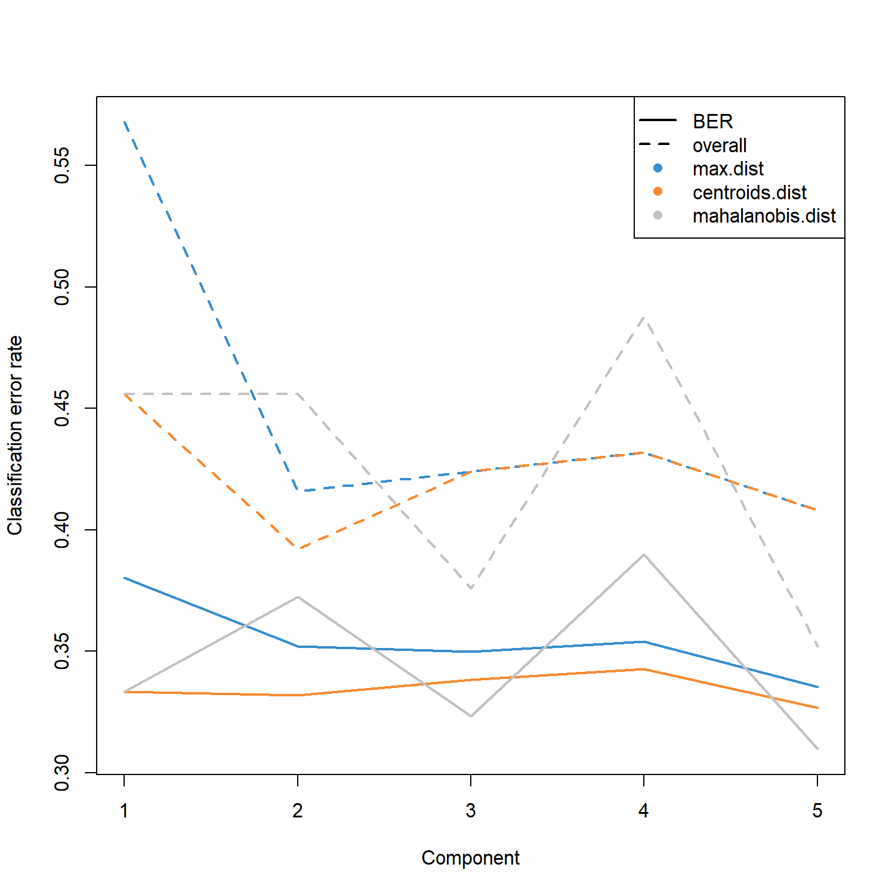

`perf()` 同時會提供多種距離方法（如 max.dist、centroids.dist、mahalanobis.dist）下的最佳 component 數量建議，並根據 `overall error rate` 與 `Balanced Error Rate (BER)` 進行評估。

```{r}
splsda.perf$choice.ncomp
```

```text
        max.dist centroids.dist mahalanobis.dist
overall        1              1                1
BER            1              1                1
```

> 在本範例中，三種距離方法均建議使用 1 個 component。

然而，在實際分析中通常仍會保留 2 個 component，以便後續進行資料視覺化（例如樣本分群圖）並捕捉更多潛在變異。因此本範例 `手動設定 optimal.ncomp = 2` 作為後續模型建立的 component 數量。

```{r}
optimal.ncomp <- 2
```

---

# 特徵數量調整

在確定 component 數量後，接著使用 `tune()` 函式調整每個 component 所保留的`特徵數量`（keepX）。此步驟會測試不同的特徵數量組合，並透過 cross-validation 評估模型表現，以找出最佳的特徵數量。

> 在本範例中，`test.keepX = seq(1, 100, 1)` 表示`測試每個 component 保留 1 到 100 個特徵的情況`。模型評估指標使用 Balanced Error Rate (BER)，並採用 max.dist 作為分類距離方法。由於 MINT 是多研究整合方法，因此在調整過程中使用 `Leave-One-Group-Out Cross Validation (LOGOCV)`，每次將一個 study 作為測試集，以評估模型在不同研究之間的泛化能力。

```{r}
tune.mint <- tune(
  X          = X,
  Y          = Y,
  study      = study,
  ncomp      = optimal.ncomp,
  test.keepX = seq(1, 100, 1),
  method     = "mint.splsda",
  measure    = "BER",
  dist       = "max.dist"
)
```

```text
Calling 'tune.mint.splsda' with Leave-One-Group-Out Cross Validation (nrepeat = 1)
```

在特徵數量調整完成後，可以利用 `plot()` 函式將 `不同 keepX 設定下的模型表現` 視覺化。圖中顯示每個 component 在不同特徵數量時的 Balanced Error Rate (BER)，有助於觀察錯誤率隨特徵數量變化的趨勢，並確認最佳的特徵選擇結果。

```{r}
png(filename = "./images/tune.png", width = 1500, height = 1500, res = 200)
plot(tune.mint, sd = FALSE)
dev.off()
```

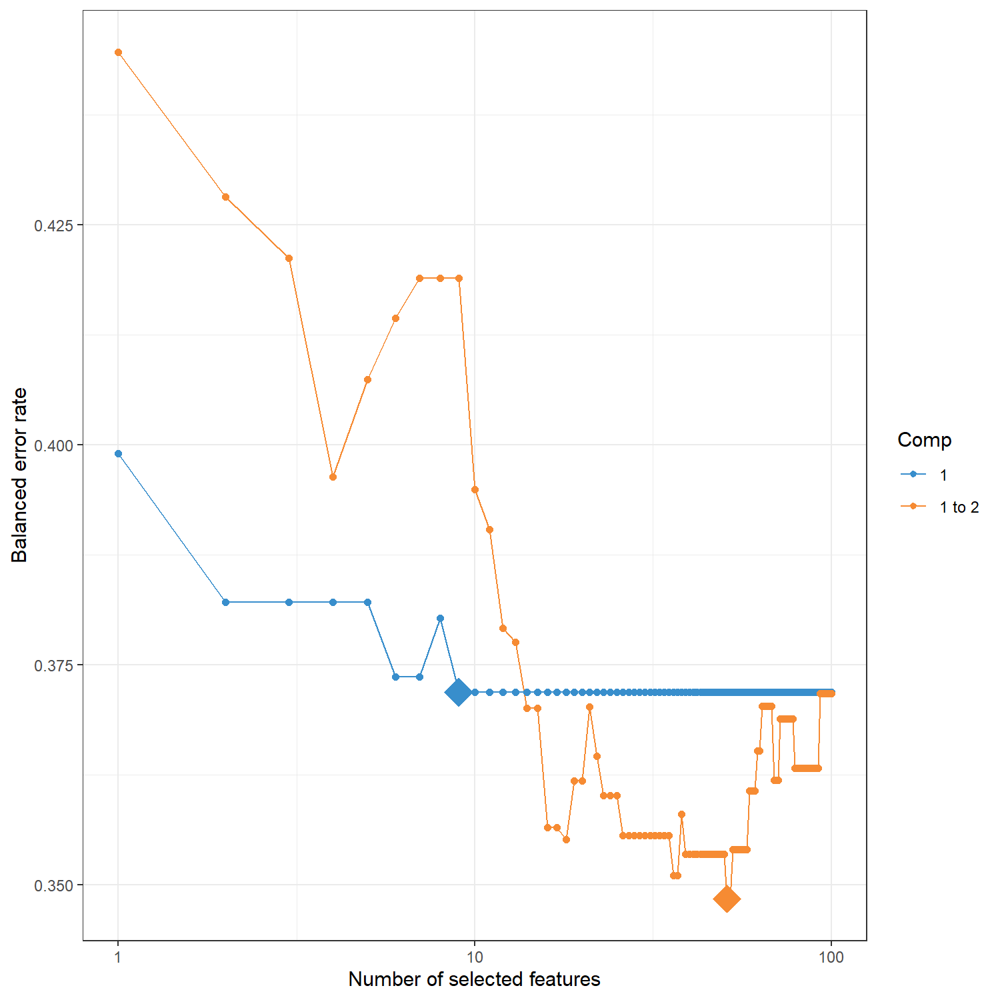

`tune.mint$choice.ncomp` 會回傳在特徵數量調整過程中，根據模型評估指標（本例為 BER）所建議的最佳 component 數量，同時顯示不同 component 在 cross-validation 下的錯誤率表現。這些結果可作為判斷 component 與特徵選擇是否合理的參考依據。

```{r}
tune.mint$choice.ncomp
```

```text
$ncomp
[1] 1

$values
      comp1     comp2
1 0.3611111 0.4666667
2 0.3333333 0.2222222
3 0.4333333 0.4916667
4 0.4444444 0.2777778
```

`tune.mint$choice.keepX` 會回傳在調整過程中所選出的 最佳特徵數量（keepX）。
這代表在每個 component 中應保留的特徵數目，以達到最低的 Balanced Error Rate (BER)。

```{r}
optimal.keepX <- tune.mint$choice.keepX
optimal.keepX
```

```text
comp1 comp2 
    9    51 
```

---

# 最終 MINT 模型

在完成 component 數量與特徵數量的調整後，接著建立`最終的 MINT sPLS-DA 模型`。此模型會使用先前選定的 `optimal.ncomp` 與 `optimal.keepX` 作為參數，在整合多個研究資料的同時進行特徵選擇與分類建模。

建立完成的模型物件 `mint.splsda.res` 會包含樣本在 latent components 上的投影結果、所選出的重要特徵，以及後續視覺化與模型評估所需的相關資訊。

```{r}
mint.splsda.res <- mint.splsda(
  X     = X,
  Y     = Y,
  study = study,
  ncomp = optimal.ncomp,
  keepX = optimal.keepX
)
```

---

# 視覺化

## plotIndiv

`plotIndiv()` 用於將樣本投影到模型建立的 latent component 空間中，以觀察不同分類之間的分布情況。在 MINT 分析中，設定 study = "global" 代表將所有研究資料整合後的樣本一起顯示，以檢視整體分類結構。

::: {.callout-important}
## 目的

觀察不同細胞類型在 component 空間中的分布，並評估模型是否能有效區分各分類。
:::

::: {.callout-tip collapse="true"}
## 如何解讀 plotIndiv 圖?

每個點代表一個樣本 (sample)點的位置由樣本在 component 空間中的 score 決定。

顏色代表不同分類 (cell type)本範例包含三種細胞類型：Fibroblast、hESC、hiPSC。

座標軸代表 latent components例如 Component 1 與 Component 2，這些 component 為多個基因特徵加權組合而形成的潛在變數。

橢圓 (ellipse)圖中的橢圓表示各分類樣本的分布範圍，若不同群體之間分離明顯，表示模型具有良好的分類能力。
:::

```{r}
png(filename = "./images/indiv.png", width = 1500, height = 1500, res = 200)
plotIndiv(mint.splsda.res, study = 'global', legend = TRUE, title = 'MINT sPLS-DA',
          subtitle = 'Global', ellipse=T)
dev.off()
```

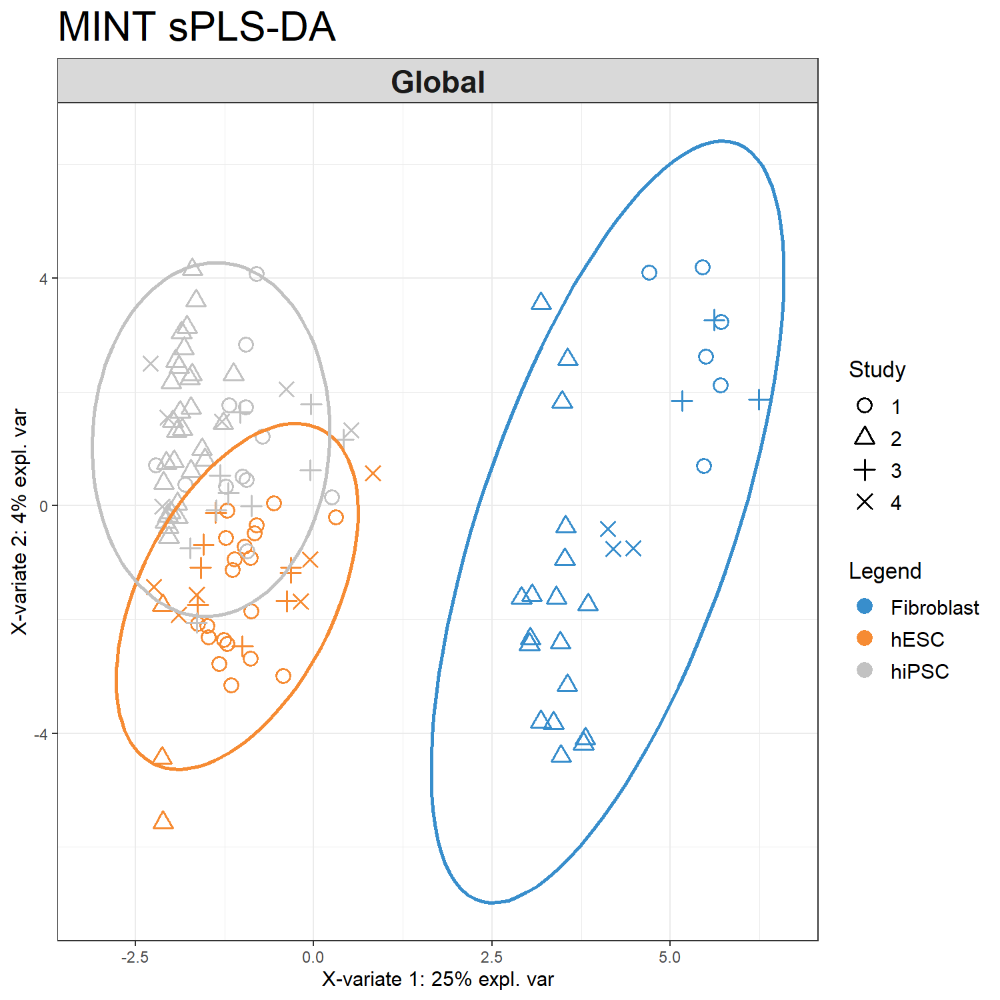

也可以透過 `study = 'all.partial'` 參數將不同 study 分開繪製

```{r}
png(filename = "./images/indiv-split.png", width = 1500, height = 1500, res = 200)
plotIndiv(mint.splsda.res, study = 'all.partial',  title = 'MINT sPLS-DA',
          subtitle = paste("Study",1:4))
dev.off()
```

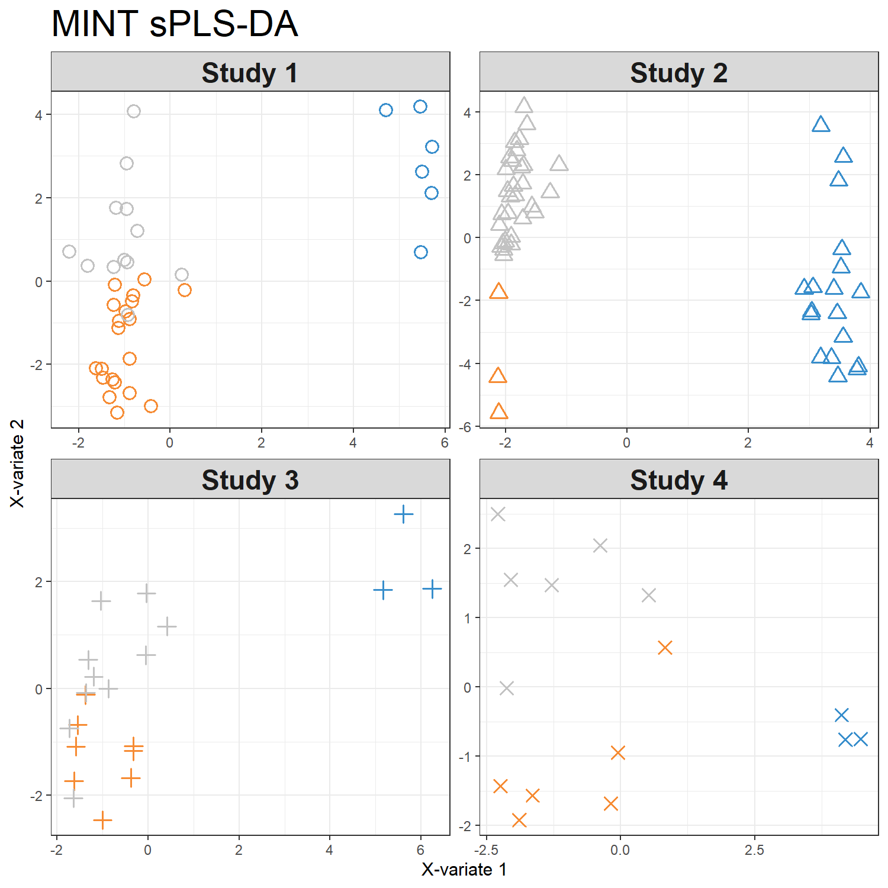

## plotVar

`plotVar()` 用於觀察模型所選出的特徵在 component 空間中的分布與關聯。在 MINT sPLS-DA 中，這些特徵通常為模型在不同 component 上選出的重要基因，可用於探索潛在的 biomarker 關係。

::: {.callout-important}
## 目的

探索模型所選出的特徵之間的相關性，並觀察它們在 component 空間中的分布模式。
:::

::: {.callout-tip collapse="true"}
## 如何解讀 plotVar 圖?

每個點代表一個特徵 (feature)
在本範例中為 gene，其位置由該特徵在 component 空間中的 loading 決定。

點之間的距離代表特徵之間的關聯

距離越近 → 代表特徵之間具有較高相關性

距離越遠 → 代表相關性較弱

cutoff 參數

cutoff = 0.5 表示僅顯示 loading 絕對值大於 0.5 的特徵，以突出對 component 影響較大的變數。

特徵名稱簡化

為避免圖中標籤過長，本範例先使用 substr() 將基因名稱縮短後再顯示。
:::

```{r}
shortenedNames <- list(
  unlist(
    lapply(
      mint.splsda.res$names$colnames$X,
      substr,
      start = 10,
      stop  = 16
    )
  )
)

png(filename = "./images/var.png", width = 1500, height = 1500, res = 200)
plotVar(mint.splsda.res,
        cutoff = 0.5,
        var.names = shortenedNames)
dev.off()
```

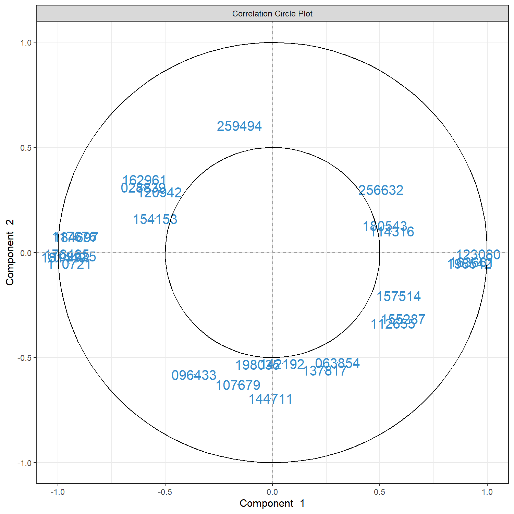

## cim

cim()（Clustered Image Map）可用於繪製 heatmap，顯示模型所選出的特徵在不同樣本中的表現模式。透過 hierarchical clustering，可以觀察樣本與特徵之間的群集關係。

::: {.callout-important}
## 目的

觀察模型所選出的特徵在不同樣本中的表現模式，並評估這些特徵是否能區分不同分類。
:::

::: {.callout-tip collapse="true"}
## 如何解讀 cim 圖?

列 (rows) 代表樣本 (samples)

每一列代表一個樣本，左側的顏色條表示樣本的分類，本範例為：

- Fibroblast

- hESC

- hiPSC

樣本通常會依據表現模式進行 hierarchical clustering，因此相似的樣本會被分在同一群。

欄 (columns) 代表特徵 (features)

每一欄代表模型在該 component 中選出的基因特徵。

顏色代表表現量 (expression level)

熱圖中的顏色表示特徵在不同樣本中的相對表現：

暖色 → 較高表現

冷色 → 較低表現

通常資料會經過標準化，因此顏色代表相對表現強度。

樣本群集 (sample clustering)

若樣本依照細胞類型形成明顯的群集，表示模型選出的特徵具有良好的分類能力。
:::

```{r}
png(filename = "./images/cim.png", width = 1500, height = 1500, res = 200)
cim(mint.splsda.res, comp = 1, margins=c(10,5),
    row.sideColors = color.mixo(as.numeric(Y)), row.names = FALSE,
    title = "MINT sPLS-DA, component 1")
dev.off()
```

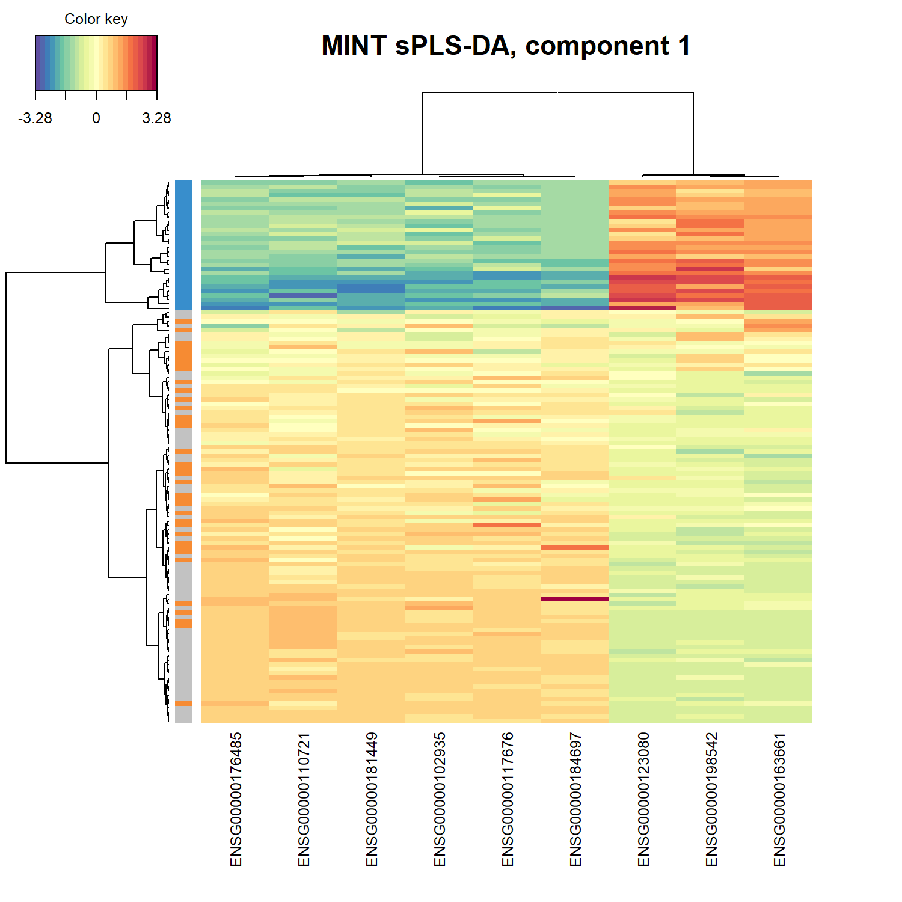

##　plotLoadings

`plotLoadings()` 用於顯示在指定 component 中對模型貢獻最大的特徵。在 MINT sPLS-DA 分析中，這些特徵通常為模型選出的重要基因，可幫助識別具有判別能力的潛在 biomarker。

::: {.callout-important}
## 目的

找出在特定 component 中對模型貢獻最大的特徵，並觀察這些特徵在不同研究（study）中的一致性。
:::

::: {.callout-tip collapse="true"}
## 如何解讀 plotLoadings 圖?

每個長條代表一個特徵 (feature)

在本範例中為 gene。長條的高度代表該特徵在 component 中的 loading 大小。

loading 大小代表特徵的重要性

|loading| 越大 → 對 component 的貢獻越大

|loading| 越小 → 對模型影響較小

因此 loading 較大的特徵通常被視為較重要的 biomarker。

不同 panel 代表不同 study

設定 study = "all.partial" 時，圖中會分別顯示不同研究資料（Study 1–Study 4）中各特徵的貢獻情形，用於觀察這些特徵在不同研究之間是否具有一致的表現模式。

method = "mean"

表示在整合不同研究資料時，使用各 study loading 的 平均值 作為整體貢獻度的估計。
:::

```{r}
png(filename = "./images/loading.png", width = 1500, height = 1500, res = 200)
plotLoadings(mint.splsda.res, contrib="max", method = 'mean', comp=1,
             study="all.partial", legend=FALSE, title="Contribution on comp 1",
             subtitle = paste("Study",1:4))
dev.off()
```

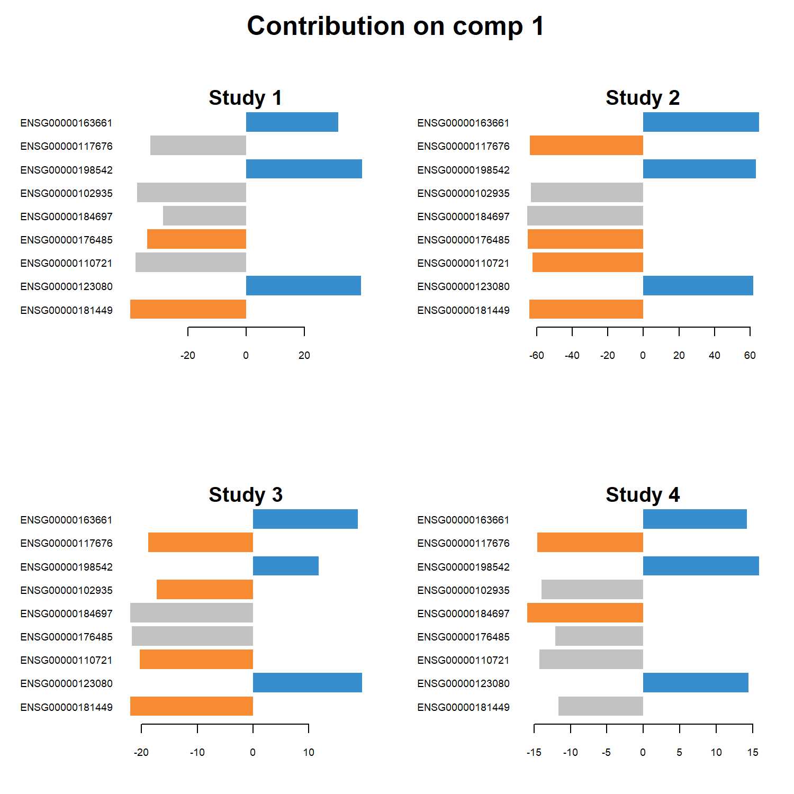

## network

network() 用於建立特徵之間的 關聯網路 (feature network)，將模型選出的重要特徵以圖形化方式呈現。透過此圖可以觀察不同特徵之間的相關性，並探索可能的分子關聯結構。

::: {.callout-important}
## 目的

將模型選出的特徵轉換為網路結構，以探索特徵之間的潛在關聯。
:::

::: {.callout-tip collapse="true"}
## 如何解讀 network 圖?

節點 (nodes)

每個節點代表一個被 MINT sPLS-DA 模型選出的特徵，例如本範例中的 gene。不同顏色或形狀可用來區分不同 component 的特徵。

連線 (edges)

節點之間的連線表示特徵之間具有相關性，代表這些變數在模型中可能具有相似的變化模式。

節點形狀與顏色

在本範例中：

rectangle 與 circle 用來區分不同 component 的特徵

color.mixo() 用於設定節點顏色，使圖形更易於辨識不同群組

網路結構 (network structure)

若某些節點具有較多連線，可能代表這些特徵在模型中具有較重要的角色，並可能參與相關的生物調控機制。
:::

```{r}
png(filename = "./images/network.png", width = 1500, height = 1500, res = 200)
network(mint.splsda.res, comp = 1,
        color.node = c(color.mixo(1), color.mixo(2)),
        shape.node = c("rectangle", "circle"))
dev.off()
```

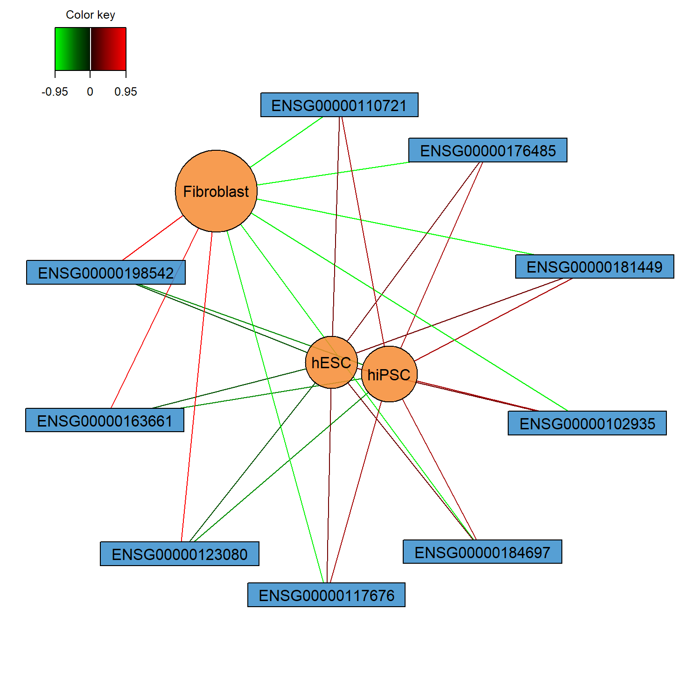

---

# 模型評估

在建立最終 MINT sPLS-DA 模型後，可以使用 `perf()` 函式評估模型的分類表現。本範例使用 max.dist 作為分類距離方法，並計算模型在不同 component 下的錯誤率。同時利用 proc.time() 記錄模型評估所需的運算時間。

perf.mint$global.error 會回傳模型的 Overall error rate 與 Balanced Error Rate (BER)，用來評估模型在分類任務中的表現。其中 BER 在不同類別樣本數不平衡時能提供較公平的評估指標。

```{r}
t1 = proc.time()

perf.mint <- perf(
  mint.splsda.res,
  progressBar = FALSE,
  dist        = "max.dist"
)

running_time = proc.time() - t1
running_time

perf.mint$global.error
```

```text
   user  system elapsed 
   0.06    0.00    0.08 
$BER
       max.dist
comp1 0.3719111
comp2 0.3484667

$overall
      max.dist
comp1    0.560
comp2    0.408

$error.rate.class
$error.rate.class$max.dist
               comp1     comp2
Fibroblast 0.0000000 0.0000000
hESC       0.9189189 0.6486486
hiPSC      0.6206897 0.4655172
```

`plot(perf.mint)` 可將模型在不同 component 數量下的分類錯誤率視覺化，幫助觀察模型表現隨 component 增加的變化情形。圖中通常會顯示 Overall Error Rate 與 Balanced Error Rate (BER) 的變化趨勢，以評估模型是否因增加 component 而改善分類能力。

```{r}
png(filename = "./images/predict.png", width = 1500, height = 1500, res = 200)
plot(perf.mint, col = color.mixo(5))
dev.off()
```

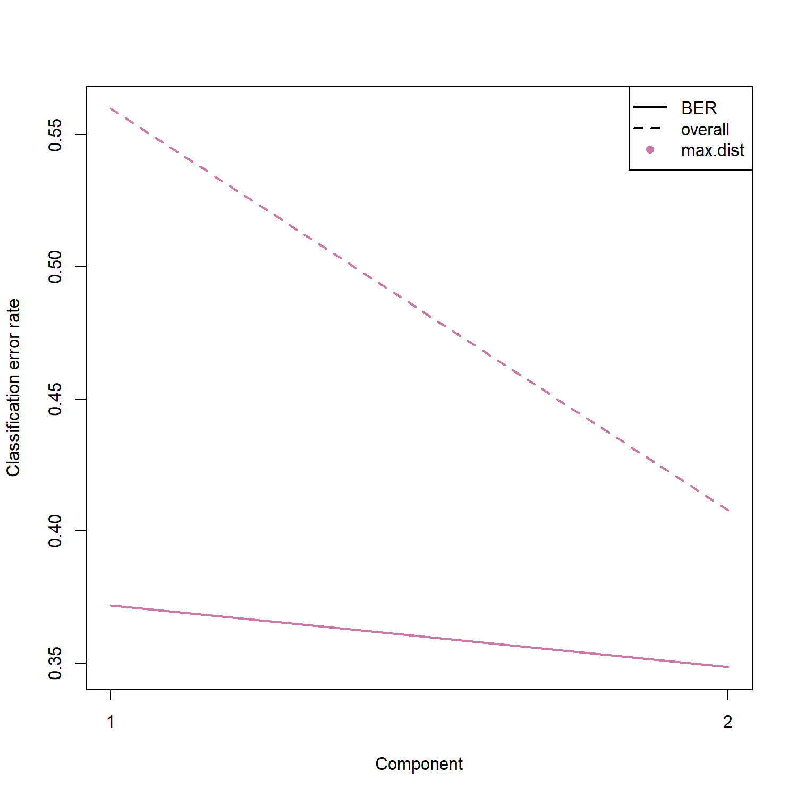

---

# 外部驗證

為了評估模型在新資料上的預測能力，可以利用 未參與模型訓練的資料進行外部驗證。本範例將 study == 3 的樣本作為測試資料，並使用 predict() 函式對其進行分類預測。

```{r}
ind.test = which(study == "3")

test.predict <- predict(
  mint.splsda.res,
  newdata    = X[ind.test, ],
  dist       = "max.dist",
  study.test = factor(study[ind.test])
)

Prediction <- test.predict$class$max.dist[, 2]
```

接著將模型預測結果與真實分類進行比較，建立 confusion matrix，用來觀察不同細胞類型之間的預測情形。從結果可以看到，大部分樣本都能被正確分類，顯示模型具有良好的分類能力。

```{r}
confusion.mat <- get.confusion_matrix(
  truth     = Y[ind.test],
  predicted = Prediction
)
```

```text
           predicted.as.Fibroblast predicted.as.hESC predicted.as.hiPSC
Fibroblast                       3                 0                  0
hESC                             0                 7                  1
hiPSC                            0                 2                  8
```

此外，也可以使用 auroc() 計算 ROC curve 與 AUC (Area Under the Curve)，以進一步評估模型的分類效能。ROC 曲線描述不同分類閾值下的預測表現，而 AUC 則提供整體分類能力的量化指標。

- component 1 的 ROC 曲線

```{r}
png(filename = "./images/roc.png", width = 1500, height = 1500, res = 200)
auc.mint.splsda = auroc(mint.splsda.res, roc.comp = 1)
dev.off()
```

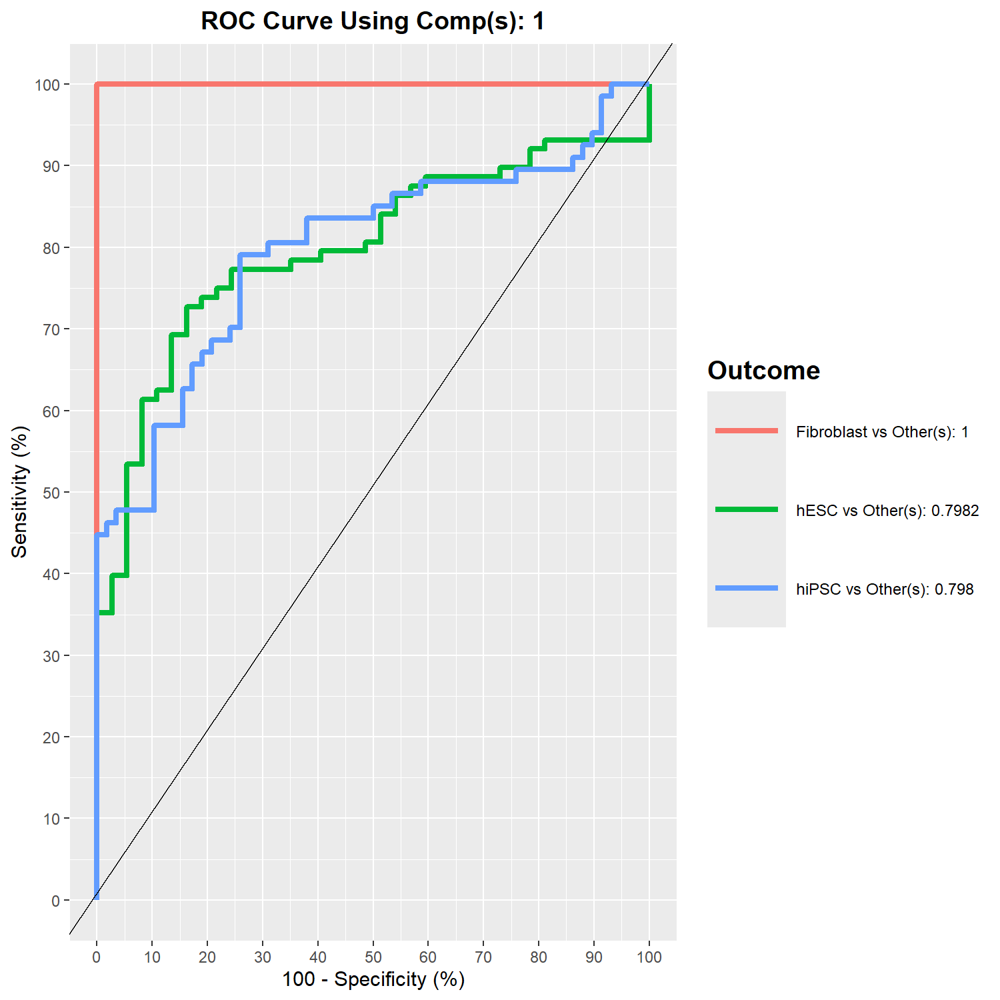

- 特定 study（study 2）在 component 2 的 ROC 表現

```{r}
png(filename = "./images/roc-study.png", width = 1500, height = 1500, res = 200)
auc.mint.splsda = auroc(mint.splsda.res, roc.comp = 2, roc.study = '2')
dev.off()
```

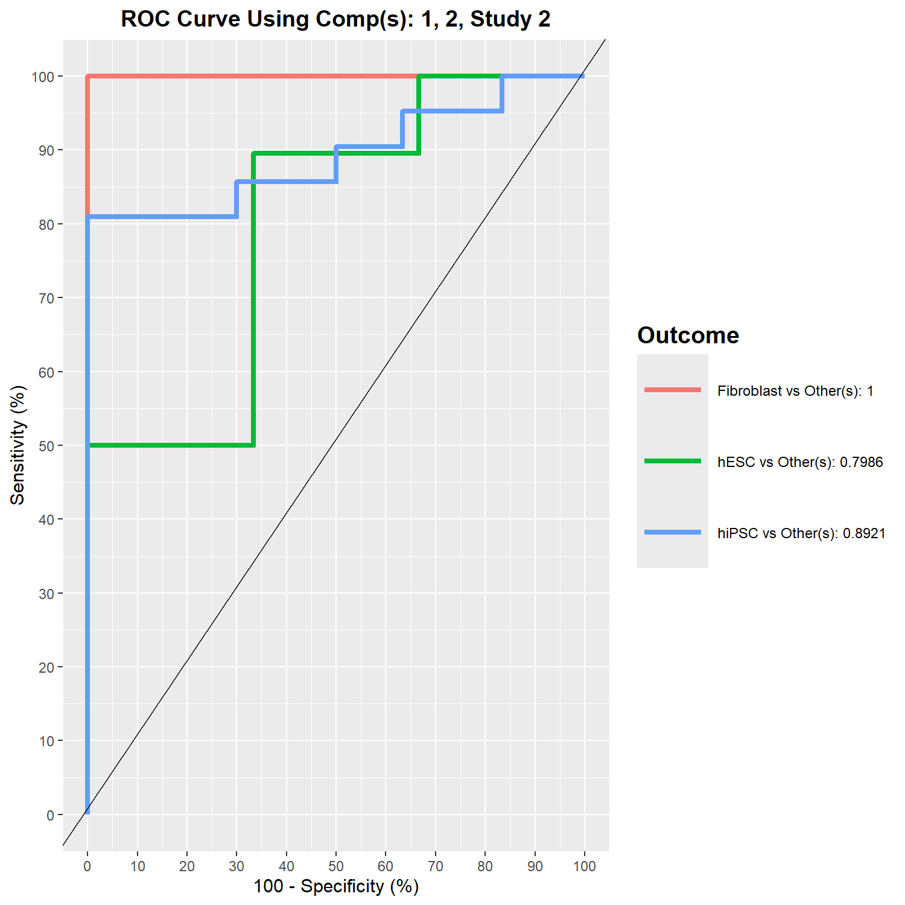