# DIABLO 介紹

在多體學（multi-omics）研究中，常會同時取得不同層級的生物資料，例如 `mRNA`、`miRNA`、`proteomics` 或 `metabolomics`。這些資料反映不同的分子調控機制，但若分開分析，往往難以完整理解其系統性關聯。因此，多體學整合方法被廣泛用於同時分析多個 omics 資料，以探索跨層級的生物訊號與潛在 biomarker。

`DIABLO（Data Integration Analysis for Biomarker discovery using Latent variable approaches for Omics studies）` 是 mixOmics 套件提供的一種 監督式多體學整合方法。其核心基於 `block sparse Partial Least Squares Discriminant Analysis (block sPLS-DA)`，透過建立 latent components，同時最大化不同 omics 資料之間的相關性與 phenotype 的分類能力。DIABLO 也會透過稀疏特徵選擇（sparse feature selection），挑選少量但具有代表性的分子特徵，以建立可解釋的多體學 biomarker signature。

在本範例中，我們使用 mixOmics 套件內建的 `TCGA breast cancer multi-omics dataset`，整合 mRNA、miRNA 與 proteomics 三種資料，示範 DIABLO 的基本分析流程，包括模型建立、參數 tuning、特徵選擇、結果視覺化以及模型評估。透過此流程，可以同時探索不同 omics 層級之間的關聯，並建立具有預測能力的多體學分類模型。

# 下載套件
```{r}
if (!requireNamespace("BiocManager", quietly = TRUE)) {
  install.packages("BiocManager")
}

if (!requireNamespace("mixOmics", quietly = TRUE)) {
  BiocManager::install("mixOmics")
}

library(mixOmics)
```

```text
Loading required package: MASS
Loading required package: lattice
Loading required package: ggplot2
Need help? Try Stackoverflow: https://stackoverflow.com/tags/ggplot2

Loaded mixOmics 6.30.0
Thank you for using mixOmics!
Tutorials: http://mixomics.org
Bookdown vignette: https://mixomicsteam.github.io/Bookdown
Questions, issues: Follow the prompts at http://mixomics.org/contact-us
Cite us:  citation('mixOmics')
```

# 範例資料

使用 `mixOmics` 套件內建的 `breast.TCGA` 資料集作為範例，其中有 `mRNA`, `miRNA` 與 `proteomics` 三種體學資料的 matrix，將其整合成一個 list

```{r}
data('breast.TCGA')
set.seed(123)

data = list(mRNA = breast.TCGA$data.train$mrna,
            miRNA = breast.TCGA$data.train$mirna,
            proteomics = breast.TCGA$data.train$protein)

lapply(data, dim)
```

```text
$mRNA
[1] 150 200

$miRNA
[1] 150 184

$proteomics
[1] 150 142
```

`Y` 表示每個樣本的乳癌分型（Basal、Her2、LumA），作為 DIABLO 模型的分類標籤（response variable）。

```{r}
Y = breast.TCGA$data.train$subtype
summary(Y)
```

```text
Basal  Her2  LumA 
   45    30    75 
```

# design matrix

在 DIABLO 分析中，design matrix 用來定義不同 omics 資料之間的關聯程度。矩陣中的數值介於 0 到 1 之間，數值越大代表模型在建立 latent components 時，越強調不同資料區塊之間的相關性。

- 0：表示不強制建立跨體學關聯  
- 接近 1：表示強化不同 omics 之間的相關性  
- 0.1–0.5：常作為中等程度的整合強度  

在此範例中，三個 omics 資料（mRNA、miRNA、proteomics）之間設定為 0.1 的弱關聯，表示模型會考慮跨體學的相關性，但不會過度強制不同資料之間必須高度一致。對角線設為 0，因為每個資料區塊本身不需要與自己建立關聯。

```{r}
design <- matrix(
  0.1,
  ncol     = length(data),
  nrow     = length(data),
  dimnames = list(names(data), names(data))
)

diag(design) = 0
design
```

```text
           mRNA miRNA proteomics
mRNA        0.0   0.1        0.1
miRNA       0.1   0.0        0.1
proteomics  0.1   0.1        0.0
```

# 初始 DIABLO 模型

使用 `block.splsda()` 建立 DIABLO 模型。此方法為 `mixOmics` 中用於多體學整合的監督式學習模型，可同時整合多個 omics 資料區塊並建立分類模型。
在此設定 `ncomp = 5`，表示模型最多建立 5 個 latent components，用於捕捉不同 omics 資料中的共同變異結構與分類訊號。

模型建立後，使用 `perf()` 進行交叉驗證（cross-validation）以評估模型效能。此範例採用 `10-fold cross-validation` 並重複 10 次，以估計模型在不同 component 數量下的分類錯誤率，並協助選擇最佳的 component 數量。

此外，利用 `proc.time()` 記錄模型評估所需的運算時間。

```{r}
sgccda.res <- block.splsda(
  X = data,
  Y = Y,
  ncomp = 5,
  design = design
)

t1 = proc.time()

perf.diablo <- perf(
  sgccda.res,
  validation = "Mfold",
  folds = 10,
  nrepeat = 10
)

running_time <- proc.time() - t1
running_time
```

```text
Design matrix has changed to include Y; each block will be
            linked to Y.
   user  system elapsed 
  18.03    0.60   18.77 
```

## 視覺化結果

`plot(perf.diablo)` 會顯示在不同 component 數量下模型的分類錯誤率，用來評估模型效能並協助選擇適合的 component 數量。

圖中會呈現不同距離計算方法（例如 max.dist、centroids.dist、mahalanobis.dist）所對應的錯誤率變化。隨著 component 數量增加，錯誤率通常會先下降後趨於穩定，因此可以依據最低錯誤率的位置來決定最佳的 component 數量。

```{r}
png(filename = "./images/perf.png", width = 1500, height = 1500, res = 200)
plot(perf.diablo)
dev.off()
```

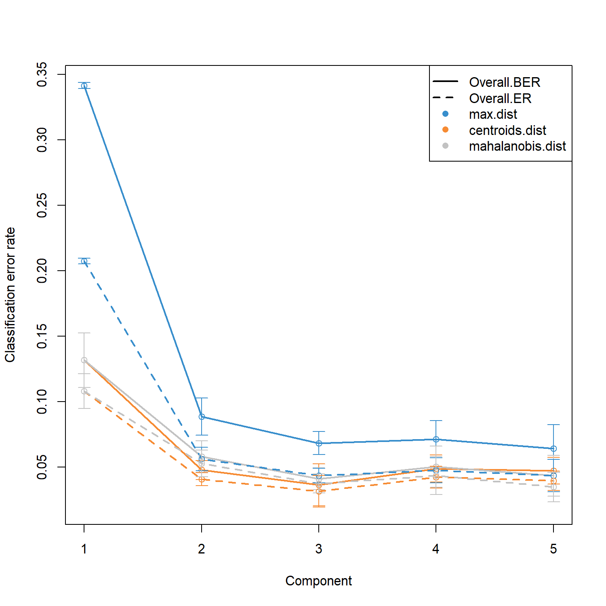

# 最佳 component 數量

`choice.ncomp` 會依據不同距離計算方式與錯誤率指標，回傳最適合的 component 數量。

其中 `WeightedVote` 為 DIABLO 分類模型常用的投票方式，會整合不同 omics 資料區塊的預測結果，以加權方式決定最終分類結果。

```{r}
perf.diablo$choice.ncomp$WeightedVote
```

```text
            max.dist centroids.dist mahalanobis.dist
Overall.ER         3              2                3
Overall.BER        3              2                3
```

根據 `perf()` 的結果，接著選擇最適合的 component 數量 (ncomp)。此處使用 `Balanced Error Rate (BER)` 作為主要評估指標，並採用 `centroids.dist` 作為分類距離方法。

`BER` 可以在類別數量不平衡的情況下提供較公平的分類評估，因此在多分類問題中常被用來作為模型選擇的依據。

```{r}
ncomp = perf.diablo$choice.ncomp$WeightedVote["Overall.BER", "centroids.dist"]
ncomp
```

```text
[1] 2
```

# 特徵數量調整

在確定最佳的 `component` 數量後，接著需要決定每個 omics 資料區塊應保留多少`特徵（keepX）`。DIABLO 採用`稀疏模型（sparse model）`，會從高維資料中選擇少量最具代表性的分子特徵，因此需要透過 `tune.block.splsda()` 來尋找最佳的特徵數量。

為了加速計算，本範例使用 `BiocParallel` 套件進行 平行運算，並設定 4 個 CPU workers。同時設定 `test.keepX`，定義每個 omics 資料區塊在不同 component 下要測試的特徵數量範圍。

```{r}
if (!requireNamespace("BiocParallel", quietly = TRUE)) {
    BiocManager::install("BiocParallel")
}
library(BiocParallel)

BPPARAM <- MulticoreParam(workers = 4)
```

接著利用 `tune.block.splsda()` 進行參數調整，透過 `10-fold cross-validation` 評估不同 keepX 組合的分類表現，並找出最適合的特徵數量。

```{r}
test.keepX = list (mRNA = c(5:9, seq(10, 18, 2), seq(20,30,5)),
                    miRNA = c(5:9, seq(10, 18, 2), seq(20,30,5)),
                    proteomics = c(5:9, seq(10, 18, 2), seq(20,30,5)))

t1 = proc.time()

tune.TCGA <- tune.block.splsda(
  X        = data,
  Y        = Y,
  ncomp    = ncomp,
  test.keepX = test.keepX,
  design   = design,
  validation = "Mfold",
  folds    = 10,
  nrepeat  = 1,
  BPPARAM  = BPPARAM,
  dist     = "centroids.dist"
)
```

```text
Design matrix has changed to include Y; each block will be
            linked to Y.

You have provided a sequence of keepX of length: 13 for block mRNA and 13 for block miRNA and 13 for block proteomics.
This results in 2197 models being fitted for each component and each nrepeat, this may take some time to run, be patient!
```

完成 `tune.block.splsda()` 之後，可以從結果中取得每個 omics 資料區塊在不同 component 下的 最佳特徵數量 (keepX)。這些數值代表在模型中保留的變數數量，也就是最終被選出的潛在 biomarker 數量。

```{r}
list.keepX = tune.TCGA$choice.keepX
tune.TCGA$choice.keepX
```

```text
$mRNA
[1] 30  7

$miRNA
[1]  9 16

$proteomics
[1] 7 5
```

# 最終 DIABLO 模型

在完成 component 與特徵數量 (keepX) 的調整後，接著建立最終 DIABLO 模型。此模型會使用先前選出的最佳 ncomp 與 keepX 參數，以整合不同 omics 資料並建立分類模型。

```{r}
sgccda.res <- block.splsda(
  X      = data,
  Y      = Y,
  ncomp  = ncomp,
  keepX  = list.keepX,
  design = design
)
```

```text
Design matrix has changed to include Y; each block will be
            linked to Y.
```

可以檢視模型所使用的 `design matrix`，確認不同 omics 資料區塊之間的整合關係。

```{r}
sgccda.res$design
```

```text
           mRNA miRNA proteomics Y
mRNA        0.0   0.1        0.1 1
miRNA       0.1   0.0        0.1 1
proteomics  0.1   0.1        0.0 1
Y           1.0   1.0        1.0 0
```

DIABLO 也會在每個 component 中選出具有代表性的特徵。使用 `selectVar()` 可以取得模型所選出的變數，例如以下程式碼顯示 mRNA block 在 component 1 所選出的基因名稱。

```{r}
selectVar(sgccda.res, block = 'mRNA', comp = 1)$mRNA$name
```

```text
 [1] "ZNF552"  "KDM4B"   "CCNA2"   "LRIG1"   "PREX1"   "FUT8"    "C4orf34" "TTC39A"  "ASPM"    "SLC43A3" "MEX3A"   "SEMA3C" 
[13] "E2F1"    "STC2"    "FMNL2"   "LMO4"    "MED13L"  "DTWD2"   "CSRP2"   "NTN4"    "KIF13B"  "SLC19A2" "NCAPG2"  "FAM63A" 
[25] "EPHB3"   "MEGF9"   "MTL5"    "HTRA1"   "SLC5A6"  "SNORA8" 
```

這些被選出的特徵即為 DIABLO 模型所識別的 `潛在 multi-omics biomarker`，可用於後續的生物學解釋或功能分析。

# 視覺化

::: {.callout-note}
DIABLO 的視覺化主要可分為三類：sample distribution、variable relationship 與 biomarker importance。
:::

## plotDIABLO

plotDiablo() 可用來觀察不同 omics 資料區塊在 latent component 空間中的整合情形，並顯示不同資料區塊之間的 `correlation`，通常 `component correlation > 0.7` 就算成功。

::: {.callout-important}
## 目的

看不同 omics 的 component 是否真的在捕捉同一個 biological signal？
:::

::: {.callout-tip collapse="true"}
## 如何解讀 plotDiablo 圖

`plotDiablo()` 會以 **pairwise matrix** 的方式顯示不同 omics block 的 component 關係：

1️⃣ **對角線 (diagonal)**  
顯示各 omics block 的名稱，例如 `mRNA`、`miRNA`、`proteomics`。

2️⃣ **右上角 (upper triangle)**  
為 **scatter plot**，表示兩個 omics block 在指定 component（例如 component 1）上的樣本分布關係。  
每個點代表一個樣本，顏色表示不同分類（例如 Basal、Her2、LumA）。  
若不同 omics 的 component 捕捉到相似的 biological signal，樣本分布方向通常會呈現一致的趨勢。

3️⃣ **左下角 (lower triangle)**  
顯示兩個 omics block component 之間的 **Pearson correlation coefficient**。  
數值越高代表不同 omics 在該 component 上的訊號越一致。

一般而言：

- `correlation > 0.7`：表示不同 omics 在該 component 上具有良好的整合效果  
- `correlation 0.4–0.7`：中等相關  
- `< 0.4`：不同 omics 捕捉到的訊號可能較不一致

因此，`plotDiablo()` 主要用於評估 **DIABLO 是否成功在不同 omics 中捕捉到共同的 biological signal**。
:::

```{r}
png(filename = "./images/diablo.png", width = 1500, height = 1500, res = 200)
plotDiablo(sgccda.res, ncomp = 1)
dev.off()
```

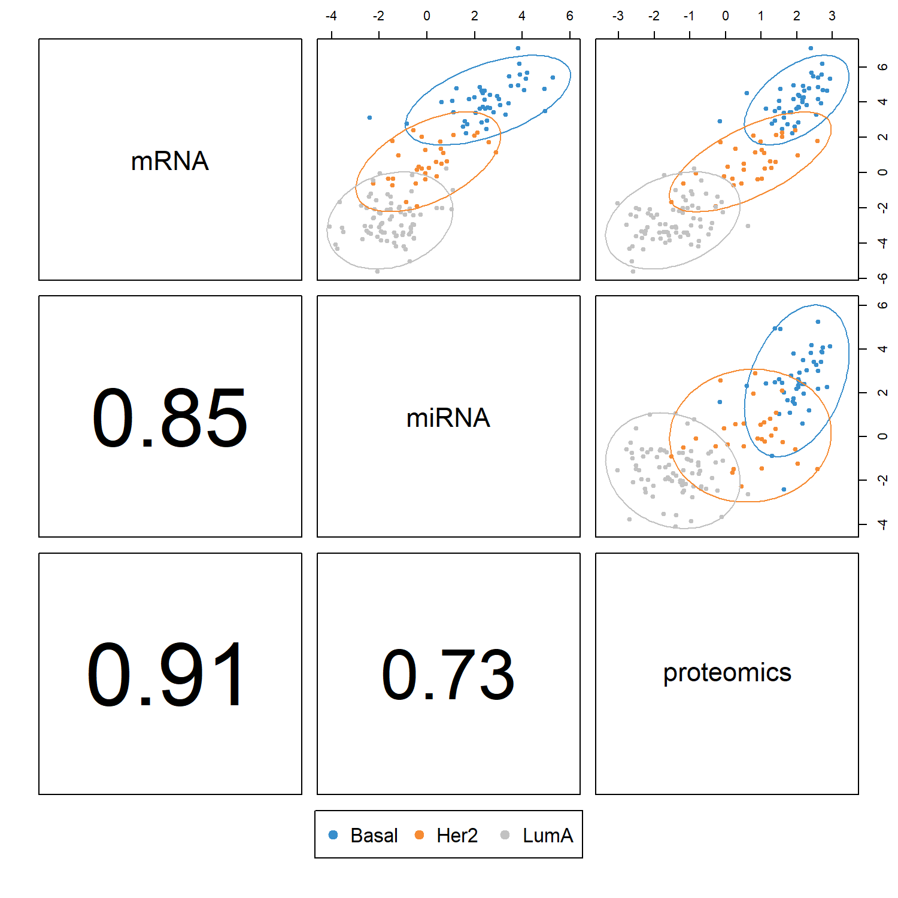

## plotIndiv

plotIndiv() 用於顯示樣本在 component 空間中的分布情況，可觀察不同分類（如癌症 subtype）是否能夠被清楚區分。

```{r}
png(filename = "./images/indiv.png", width = 1500, height = 1500, res = 200)
plotIndiv(sgccda.res, ind.names = FALSE, legend = TRUE,  style="ggplot2")
dev.off()
```

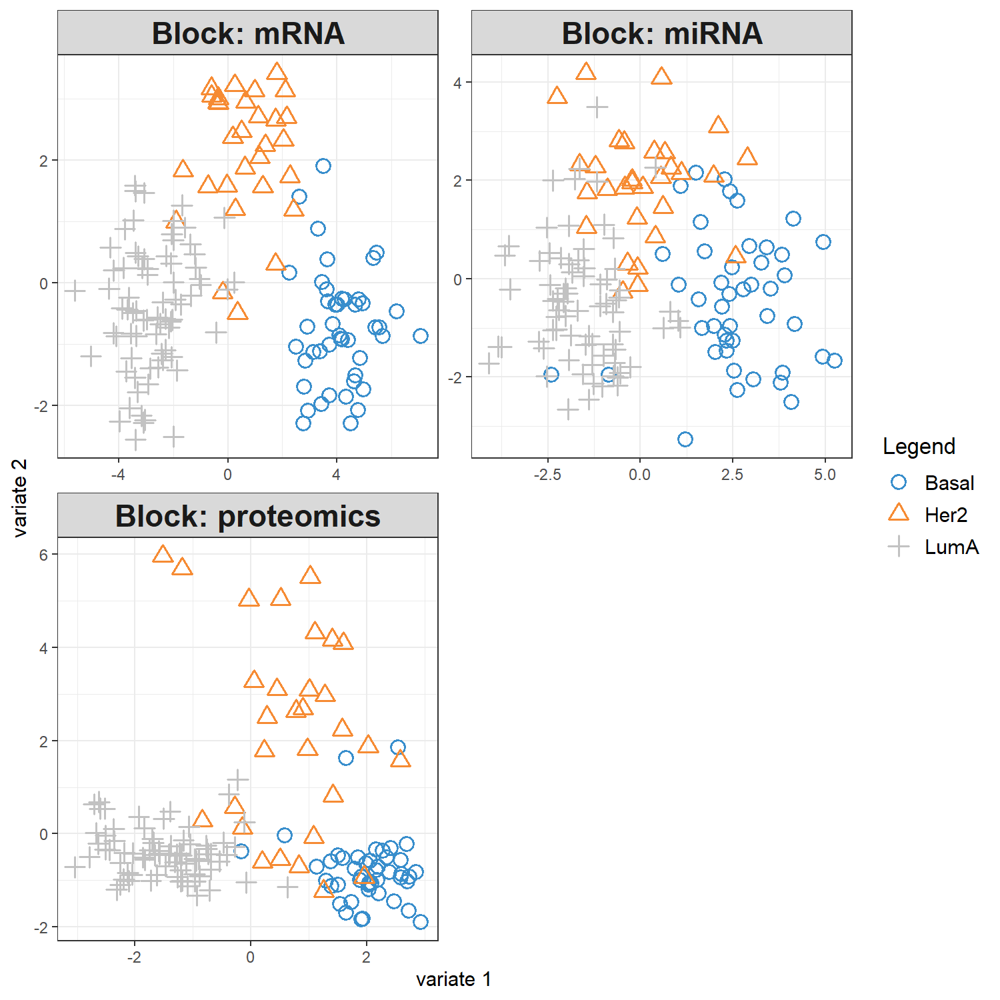

## plotArrow

plotArrow() 顯示同一樣本在不同 omics 空間中的投影位置，箭頭越短表示不同 omics 對該樣本的表示越一致。

```{r}
png(filename = "./images/arrow.png", width = 1500, height = 1500, res = 200)
plotArrow(sgccda.res, ind.names = FALSE, legend = TRUE, title = 'DIABLO')
dev.off()
```

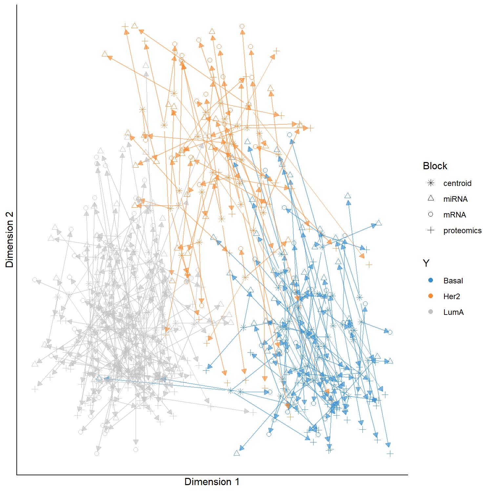

## plotVar

plotVar() 可用於觀察不同 omics 特徵在 component 空間中的分布與關聯。

```{r}
png(filename = "./images/var.png", width = 1500, height = 1500, res = 200)
plotVar(sgccda.res, var.names = FALSE, style = 'graphics', legend = TRUE,
        pch = c(16, 17, 15), cex = c(2,2,2), col = c('darkorchid', 'brown1', 'lightgreen'))
dev.off()
```

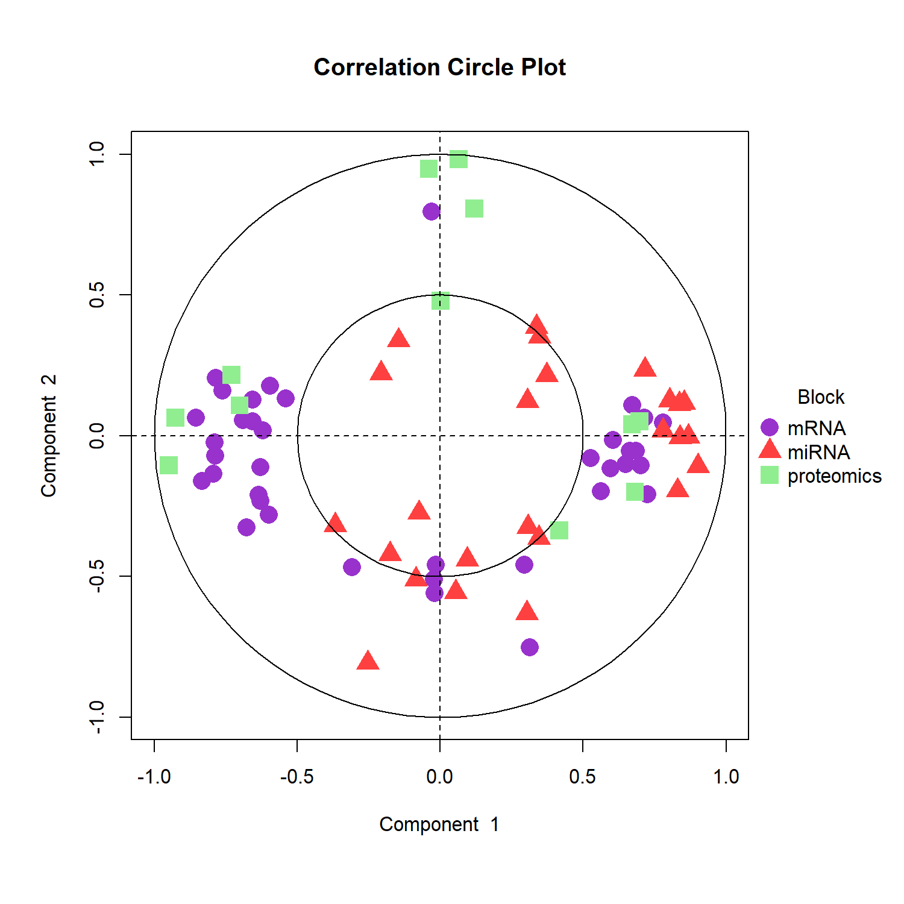

也可以只顯示特定 component 的變數分布。

```{r}
png(filename = "./images/var-comp.png", width = 1500, height = 1500, res = 200)
plotVar(sgccda.res, var.names = FALSE, style = 'graphics', legend = TRUE,
        pch = c(16, 17, 15), cex = c(2,2,2), col = c('darkorchid', 'brown1', 'lightgreen'),
        comp.select = 1)
dev.off()
```

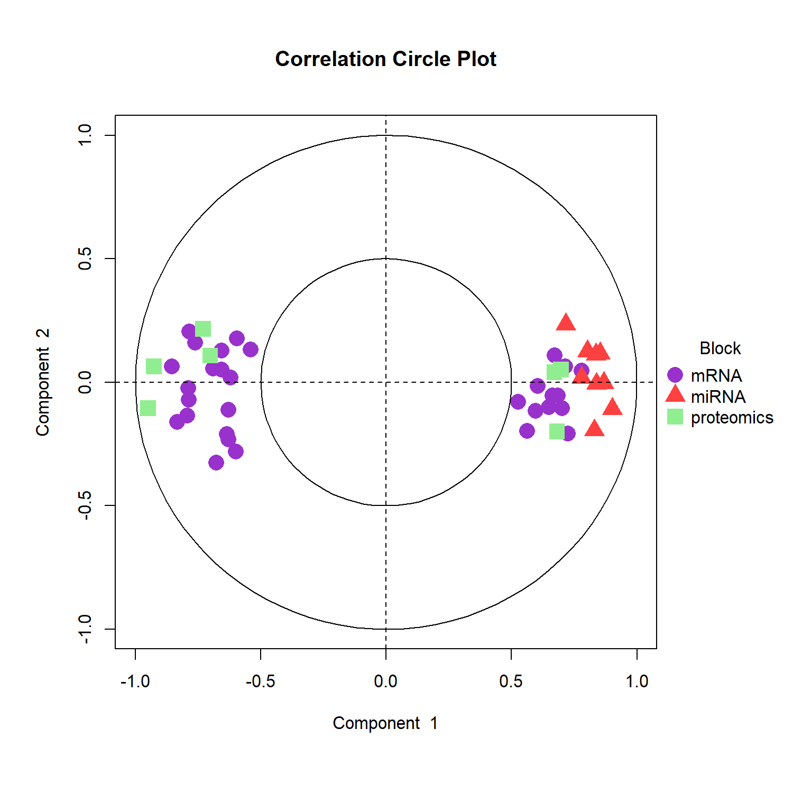

## circosPlot

circosPlot() 以 circos diagram 的方式顯示不同 omics 特徵之間的相關性，常用於探索跨體學的分子關聯。

```{r}
png(filename = "./images/circos.png", width = 1500, height = 1500, res = 200)
circosPlot(sgccda.res, cutoff = 0.7, line = TRUE,
           color.blocks= c('darkorchid', 'brown1', 'lightgreen'),
           color.cor = c("chocolate3","grey20"), size.labels = 1.5)
dev.off()
```

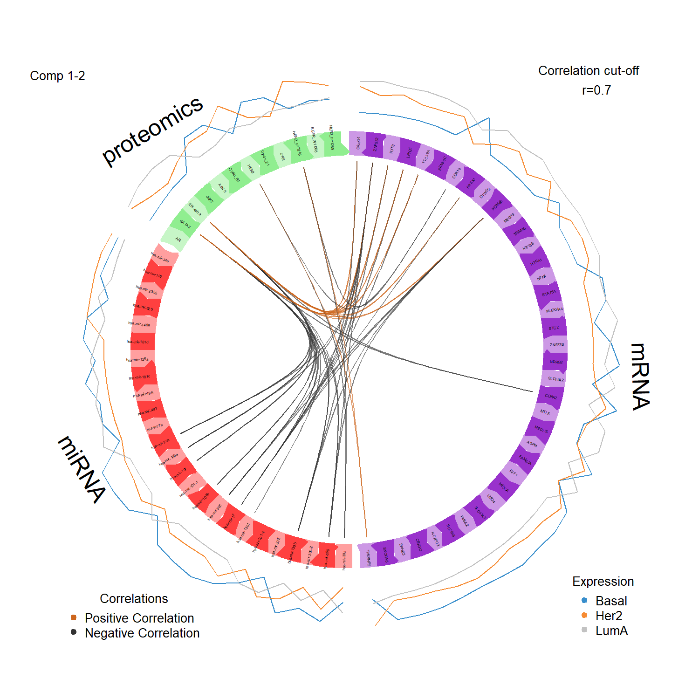


## network

network() 則可建立特徵之間的網路結構，顯示不同 omics biomarker 之間的相關性。

```{r}
png(filename = "./images/network.png", width = 1500, height = 1500, res = 200)
network(sgccda.res, blocks = c(1,2,3),
        color.node = c('darkorchid', 'brown1', 'lightgreen'), cutoff = 0.4)
dev.off()
```

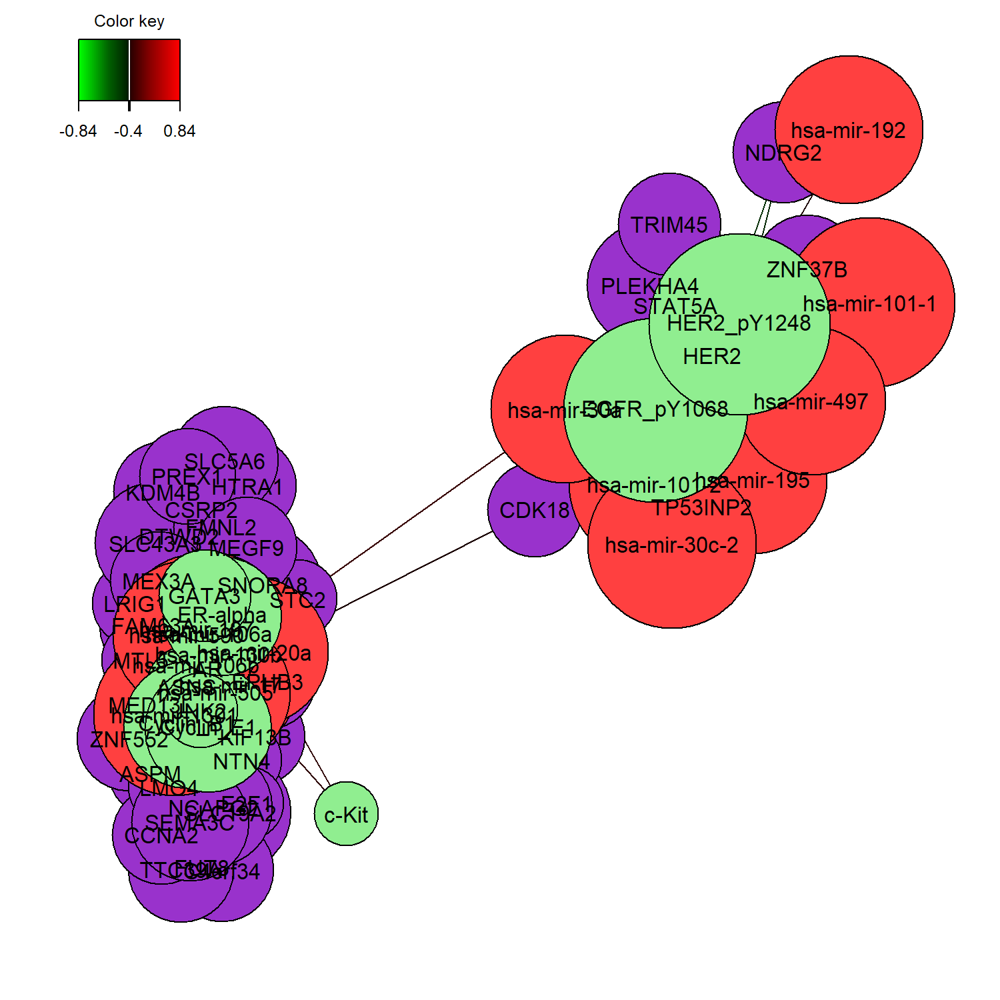

若需要進一步進行網路分析，可將 network 匯出為 GML 格式，並於 Cytoscape 或其他網路分析工具中進行視覺化。

```{r}
library(igraph)
my.network = network(sgccda.res, blocks = c(1,2,3),
         color.node = c('darkorchid', 'brown1', 'lightgreen'), cutoff = 0.4)
write_graph(my.network$gR, file = "data/myNetwork.gml", format = "gml")
```

## plotLoadings

plotLoadings() 用於顯示每個 component 中對模型貢獻最大的變數。

```{r}
png(filename = "./images/loadings.png", width = 1500, height = 1500, res = 200)
plotLoadings(sgccda.res, comp = 2, contrib = 'max', method = 'median')
dev.off()
```

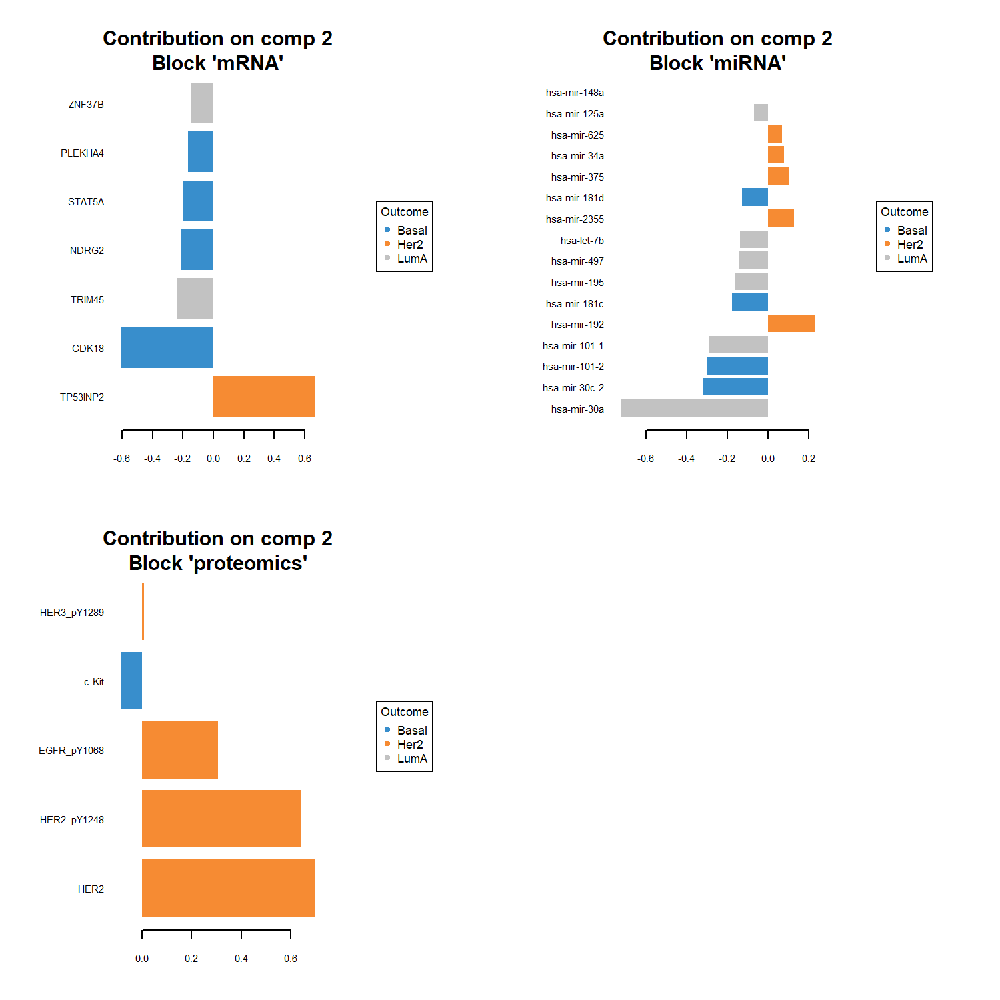

## cimDiablo

最後，cimDiablo() 可以繪製 clustered image map (heatmap)，顯示不同 omics 特徵在樣本之間的表現模式。

```{r}
png(filename = "./images/cimdiablo.png", width = 1500, height = 1500, res = 200)
cimDiablo(sgccda.res, color.blocks = c('darkorchid', 'brown1', 'lightgreen'),
          comp = 1, margin=c(8,20), legend.position = "right")
dev.off()
```

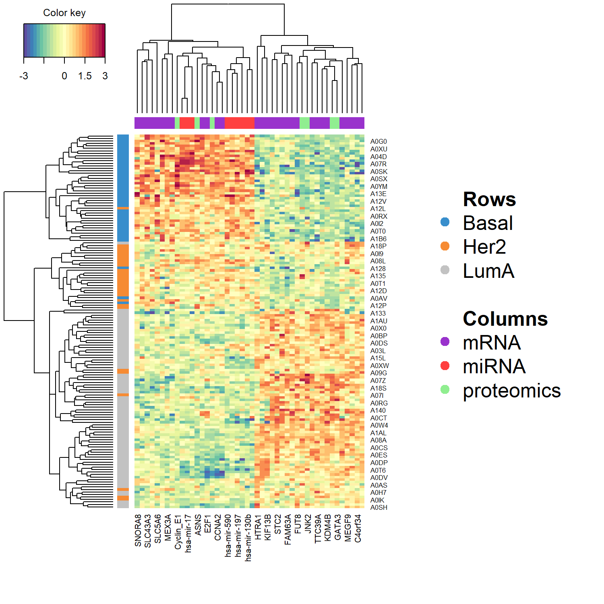

# 模型評估

在建立最終 DIABLO 模型後，可以透過 perf() 進行模型效能評估。本範例採用 10-fold cross-validation 並重複 10 次，以評估模型在不同資料分割下的分類表現。dist = "centroids.dist" 表示使用 centroid distance 作為分類判定方式。此外，利用 proc.time() 記錄模型評估所需的運算時間。

```{r}
set.seed(123)
t1 = proc.time()
perf.diablo = perf(sgccda.res, validation = 'Mfold', folds = 10, nrepeat = 10,
                   dist = 'centroids.dist')

running_time <- proc.time() - t1
running_time
```

```text
   user  system elapsed 
   7.47    0.22    7.69 
```

perf() 的結果可提供不同投票策略下的分類錯誤率，包括 Majority vote 與 Weighted vote。Majority vote 以多數決方式整合不同 omics block 的預測結果，而 Weighted vote 則會根據各 block 的預測表現進行加權。

```{r}
perf.diablo$MajorityVote.error.rate

perf.diablo$WeightedVote.error.rate
```

```text
$centroids.dist
                 comp1      comp2
Basal       0.03333333 0.03333333
Her2        0.17333333 0.14000000
LumA        0.06533333 0.01600000
Overall.ER  0.07733333 0.04600000
Overall.BER 0.09066667 0.06311111

$centroids.dist
                 comp1      comp2
Basal       0.01555556 0.03333333
Her2        0.11666667 0.10666667
LumA        0.06533333 0.01466667
Overall.ER  0.06066667 0.03866667
Overall.BER 0.06585185 0.05155556
```

此外，也可以使用 auroc() 計算 ROC curve 與 AUC (Area Under the Curve)，用來評估模型的分類能力。此範例以 miRNA block 的第二個 component 為例計算 AUC。

```{r}
png(filename = "./images/auroc.png", width = 1500, height = 1500, res = 200)
auc.diablo = auroc(sgccda.res, roc.block = "miRNA", roc.comp = 2)
dev.off()
```

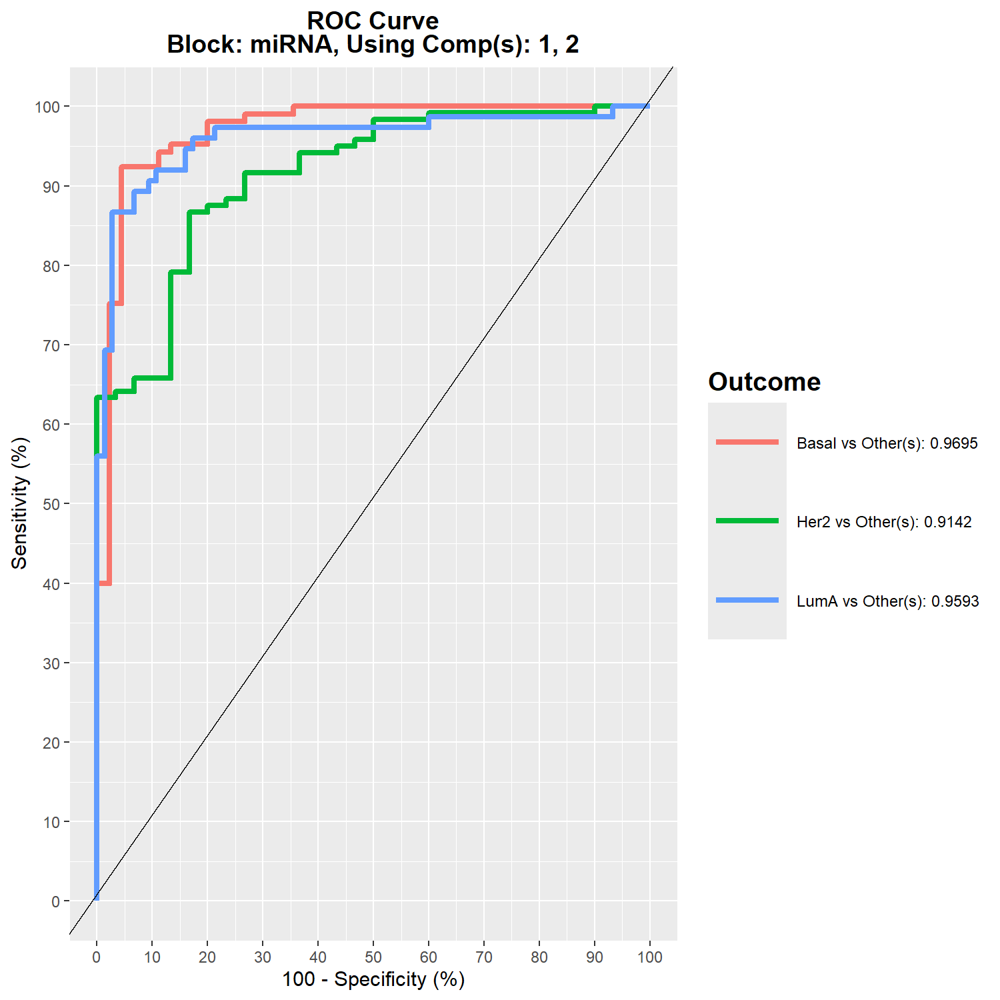

# 外部驗證

為了評估模型在新資料上的預測能力，可以使用 獨立的測試資料（test set） 進行外部驗證。本範例使用 breast.TCGA 資料集中提供的 data.test 作為測試資料。此測試資料僅包含 mRNA 與 miRNA 兩個 omics block，而缺少 proteomics block，DIABLO 模型仍可利用現有的資料區塊進行預測。

```{r}
data.test.TCGA = list(mRNA = breast.TCGA$data.test$mrna,
                      miRNA = breast.TCGA$data.test$mirna)

predict.diablo = predict(sgccda.res, newdata = data.test.TCGA)
```

接著將模型預測結果與真實分類進行比較，建立 confusion matrix，並計算 Balanced Error Rate (BER) 來評估模型的分類表現。

```{r}
confusion.mat = get.confusion_matrix(truth = breast.TCGA$data.test$subtype,
                     predicted = predict.diablo$WeightedVote$centroids.dist[,2])
confusion.mat
get.BER(confusion.mat)
```

```text
      predicted.as.Basal predicted.as.Her2 predicted.as.LumA
Basal                 20                 1                 0
Her2                   0                14                 0
LumA                   0                 1                34
[1] 0.02539683
```

Confusion matrix 可顯示不同分類之間的預測結果，而 BER 則可在類別數量不平衡的情況下提供較公平的分類評估指標。